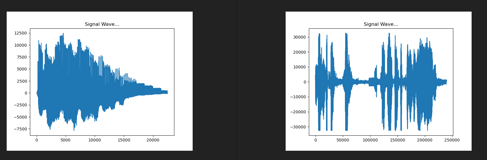
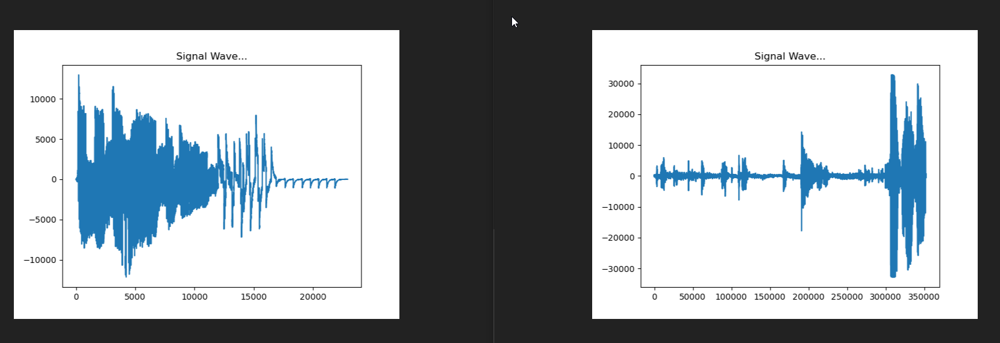
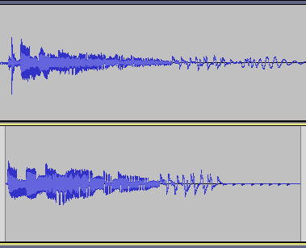

# whosthatpokemon-AudioWaveComparison

matplotlib results of pokemon sound comparions, twitch stream vs original audio.

wav of Pokemon on left;   wav of stream on right

  

Audacity comparison of farfetched audio placed in the same position: 

Pokemon cries pulled from: <a href='https://github.com/kuo22/pokemon-cries'>here</a>

 
# Notes

Current build requires python 3.8 with what I have installed, I'll need to scale this down or my bot up a version so they can work in tandem.

To get Audio from windows speakers you need to enable and select "Stereo Mix" from sound options. If you can't see it make sure "show disabled devices" is selected.

If its STILL not there you will need to download a driver, offical link: https://www.realtek.com/en/component/zoo/category/pc-audio-codecs-high-definition-audio-codecs-software
but that takes 4hrs (I assume bad servers) so use this one instead: https://download.cnet.com/Realtek-High-Definition-Audio-Codec-Windows-7-8-8-1-10-64-bit/3000-2120_4-77507761.html

Once you have the stereo Mix showing and enabled it may not appear to be working, you must insure there is a jack in the headset port on your computer, plugged into something or not.

PyAudio (I had issues with pip so here is a direct link): https://www.lfd.uci.edu/~gohlke/pythonlibs/#pyaudio

cp33 means Python 3.3 

for pyAudio to work on windows you need to install Microsoft Visual C++ with "Microsoft Visual C++ Build Tools: https://visualstudio.microsoft.com/visual-cpp-build-tools/

Pydub for converting stereo to mono 

Pydub requires ffmpeg 

ffmpeg for windows: https://ffmpeg.zeranoe.com/builds/

Lots of restarts for all of this to play nice.

other depedencies 

matplotlib
numpy
wave

further exploration:

https://audiodiff.readthedocs.io/en/latest/

https://docs.scipy.org/doc/scipy/reference/tutorial/fft.html (reccommended by vexedkiller0071)

Next steps:

Decide how i am going to compare the recorded wave with the stored ones.

Should I try and cut the recorded clip to the same size as the pokemon cry audio first?

